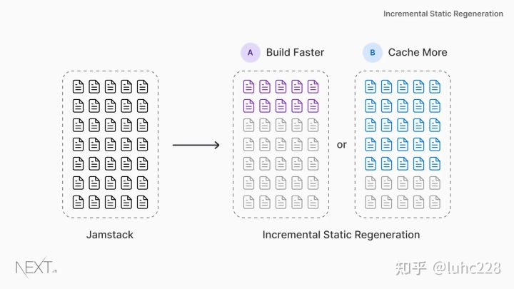

# Nextjs 学习

## 什么是 Next？能做什么？

Next 是一个应用在生产环境中的 react 框架，内置支持服务端渲染（SSR），静态页面生成（SSG），自带路由等

## 安装

We recommend creating a new Next.js app using `create-next-app`, which sets up everything automatically for you. To create a project, run:

```bash
npx create-next-app@latest
# or
yarn create next-app
```

If you want to start with a TypeScript project you can use the `--typescript` flag:

```bash
npx create-next-app@latest --typescript
# or
yarn create next-app --typescript
```

## 路由、页面间导航

### 静态路由

Next 静态路由把 /page 目录解析成根目录，将 URL 的域名后续部分按照文件系统的规则直接路由

例：

```
/page/index.js => /
/page/abc.js => /abc
```

### 动态路由

动态路由可以接收动态的路由参数

例如，将js文件名称设置为 [id].js

内容为：

```jsx
import Link from 'next/link'
import Head from 'next/head'
import Container from '../../components/container'
import { getAllPostIds, getPostData } from '../../lib/posts'
export default function Post({ postData }) {
return (
<container>
{postData.id}
<br>
{postData.title}
<br>
{postData.date}
</container>
)
}
export async function getStaticPaths() {
const paths = getAllPostIds()
return {
paths,
fallback: false
}
}
export async function getStaticProps({ params }) {
const postData = getPostData(params.id)
return {
props: {
postData
}
}
}
```

文件 post,js

``` jsx
export function getPostData(id) {
const postOne = {
title: 'One',
id: 1,
date: '7/12/2020'
}
const postTwo = {
title: 'Two',
id: 2,
date: '7/12/2020'
}
if(id == 'one'){
return postOne;
}else if(id == 'two'){
return postTwo;
}
}
export function getAllPostIds() {
return [{
params: {
id: 'one'
}
},
{
params: {
id: 'two'
}
}
];
}
```

启动后：

访问 localhost:3000/posts/one


访问 localhost:3000/posts/two


### API 路由

next 除了支持页面路由外还支持了 api 路由

例如：创建文件 /page/api/hello.js 文件内容为：

``` jsx
export default function handler(req, res) {
  res.status(200).json({ text: 'Hello' })
}
```

访问 http://localhost:3000/api/hello 得到以下内容：

``` json
{"text":"Hello"}
```

## 资源、元数据和css

### 资源

在 Next 中，类似图片资源等静态资源可以放置在 public 目录，这样操作上就可以按照文件系统的规则被链接

例：

``` 
/public/img/abc.png => /img/abc.png
```

### 元数据

如果要在组件中维护页面的 \<head> 头，可以使用 \<Head> 标记。

例：

``` jsx
export default function FirstPost() {
  return (
    <>
      <Head>
        <title>First Post</title>
      </Head>
      …
    </>
  )
}
```

在组件中这样使用 \<Head> 标签，title 元素将自动被覆写为新的 title 在页面上生效。

### CSS

可以使用 CSS 模块，可为某一个组件设置仅限于本组件作用域的 CSS ，能有效的解决classname 重名问题

使用 styled-jsx 库可以为组件创建专属作用域的 CSS 并且其支持Sass 

具体应用方法：

1. 创建顶级目录 components

2. 创建文件 layout.js 内容：

   ``` jsx
   export default function Layout({ children }) {
     return <div>{children}</div>
   }
   ```

3. 在父组件（pages/posts/first-post.js）中引入该组件

   ``` jsx
   import Head from 'next/head'
   import Link from 'next/link'
   import Layout from '../../components/layout'
   
   export default function FirstPost() {
     return (
       <Layout>
         <Head>
           <title>First Post</title>
         </Head>
         <h1>First Post</h1>
         <h2>
           <Link href="/">
             <a>Back to home</a>
           </Link>
         </h2>
       </Layout>
     )
   }
   ```

4. 给子组件 layout.js 添加样式，在 components 目录下新建 layout.module.css ，填入内容：

   ``` css
   .container {
     max-width: 36rem;
     padding: 0 1rem;
     margin: 3rem auto 6rem;
   }
   ```

5. import 引入样式到组件

   ``` jsx
   import styles from './layout.module.css'
   
   export default function Layout({ children }) {
     return <div className={styles.container}>{children}</div>
   }
   ```

   效果：

   

### 全局样式

添加全局样式的基本方法是在顶层组件中添加非模块化的 CSS

在 pages 目录下创建文件 _app.js 并填入以下代码：

``` jsx
export default function App({ Component, pageProps }) {
  return <Component {...pageProps} />
}
```

这样的组件规则创建了一个顶层组件，再此我们可以附加 CSS 全局规则

> 注意：修改顶层组件可能需要重启服务才能生效

创建顶层目录 style 创建文件 /style/global.css 填入代码：

``` css
html,
body {
  padding: 0;
  margin: 0;
  font-family: -apple-system, BlinkMacSystemFont, Segoe UI, Roboto, Oxygen, Ubuntu,
    Cantarell, Fira Sans, Droid Sans, Helvetica Neue, sans-serif;
  line-height: 1.6;
  font-size: 18px;
}

* {
  box-sizing: border-box;
}

a {
  color: #0070f3;
  text-decoration: none;
}

a:hover {
  text-decoration: underline;
}

img {
  max-width: 100%;
  display: block;
}
```

然后，将其引入到顶层组件 /page/_app.js 中

``` jsx
import '../styles/global.css'

export default function App({ Component, pageProps }) {
  return <Component {...pageProps} />
}
```

## 预渲染模式

next 支持三种预渲染模式

笔记来源：https://www.cnblogs.com/sexintercourse/p/15269766.html

普通的单页应用只有一个 HTML，初次请求返回的 HTML 中没有任何页面内容，需要通过网络请求 JS bundle 并渲染，整个渲染过程都在客户端完成，所以叫客户端渲染（CSR）。这种渲染方式虽然在后续的页面切换速度很快，但是也明显存在两个问题：

1. 白屏时间过长：在 JS bundle 返回之前，页面一直是空白的。假如 bundle 体积过大或者网络条件不好的情况下，体验会更不好
2. SEO 不友好：搜索引擎访问页面时，只会看 HTML 中的内容，默认是不会执行 JS，所以抓取不到页面的具体内容

### SSR 服务端渲染

服务端渲染指的是用户直接请求服务器端的页面代码数据，服务器直接下发 html 代码，这样做的好处是利于 SEO 优化，一次加载到位，优化白屏时间

react 从框架的层面提供支持，只需要调用 renderToString(Component) 就可得到具体 html 内容

Next.js 提供 `getServerSideProps` 异步函数，以在 SSR 场景下获取额外的数据并返回给组件进行渲染。`getServerSideProps` 可以拿到每次请求的上下文（`Context`)，举个例子：

``` jsx
export default function FirstPost(props) {
  // 在 props 中拿到数据
  const { title } = props;
  return (
    <Layout>
      <h1>{title}</h1>
    </Layout>
  )
}

export async function getServerSideProps(context) {
  console.log('context', context.req);
  // 模拟获取数据
  const title = await getTitle(context.req);
  // 把数据放在 props 对象中返回出去
  return {
    props: {
      title
    }
  }
}
```

SSR 方案虽然解决了 CSR 带来的两个问题，但是同时又引入另一个问题：需要一个服务器承载页面的实时请求、渲染和响应，这无疑会增大服务端开发和运维的成本。另外对于一些较为静态场景，比如博客、官网等，它们的内容相对来说比较确定，变化不频繁，每次通过服务端渲染出来的内容都是一样的，无疑浪费了很多没必要的服务器资源。这时，有没有一种方案可以让这些页面变得静态呢？这时，静态站点生成（SSG，也叫构建时预渲染）诞生了。

### SSG 编译构建预渲染

预编译构建时服务端将页面编译成静态的html页面，这样的页面加载时并不需要消耗服务器算力资源，不需要服务器再次渲染

Next.js 默认为每个页面开启 SSG。对于页面内容需要依赖静态数据的场景，允许在每个页面中 `export` 一个 `getStaticProps` 异步函数，在这个函数中可以把该页面组件所需要的数据收集并返回。当 `getStaticProps` 函数执行完成后，页面组件就能在 `props` 中拿到这些数据并执行静态渲染。举个在静态路由中使用 SSG 的例子：

``` jsx
// pages/posts/first-post.js
function Post(props) {
  const { postData } = props;

  return <div>{postData.title}</div>
}

export async function getStaticProps() {
  // 模拟获取静态数据
  const postData = await getPostData();
  return {
    props: { postData }
  }
}
```

对于动态路由的场景，Next.js 提供 `getStaticPaths` 异步函数，在这个方法中，会返回一个 `paths` 数组，这个数组包含了这个动态路由在构建时需要预渲染的页面数据。举个例子：

``` jsx
// pages/posts/[id].js
function Post(props) {
  const { postData } = props;

  return <div>{postData.title}</div>
}

export async function getStaticPaths() {
  // 返回该动态路由可能会渲染的页面数据，比如 params.id
  const paths = [
    {
      params: { id: 'ssg-ssr' }
    },
    {
      params: { id: 'pre-rendering' }
    }
  ]
  return {
    paths,
    // 命中尚未生成静态页面的路由直接返回 404 页面
    fallback: false
  }
}

export async function getStaticProps({ params }) {
  // 使用 params.id 获取对应的静态数据
  const postData = await getPostData(params.id)
  return {
    props: {
      postData
    }
  }
}
```

当我们执行 `nextjs build` 后，可以看到打包结果包含 `pre-rendering.html` 和 `ssg-ssr.html` 两个 HTML 页面，也就是说在执行 SSG 时，会对 `getStaticPaths` 函数返回的 `paths` 数组进行循环，逐一预渲染页面组件并生成 HTML。

```
├── server
|  ├── chunks
|  ├── pages
|  |  ├── api
|  |  ├── index.html
|  |  ├── index.js
|  |  ├── index.json
|  |  └── posts
|  |     ├── [id].js
|  |     ├── first-post.html
|  |     ├── first-post.js
|  |     ├── pre-rendering.html       # 预渲染生成 pre-rendering 页面
|  |     ├── pre-rendering.json
|  |     ├── ssg-ssr.html             # 预渲染生成 ssg-ssr 页面
|  |     └── ssg-ssr.json
```

SSG 虽然很好解决了白屏时间过长和 SEO 不友好的问题，但是它仅仅适合于页面内容较为静态的场景，比如官网、博客等。面对页面数据更新频繁或页面数量很多的情况，它似乎显得有点束手无策，毕竟在静态构建时不能拿到最新的数据和无法枚举海量页面。这时，就需要增量静态再生成(Incremental Static Regeneration)方案了。

### ISR 增量静态页面生成



Next.js 推出的 ISR(Incremental Static Regeneration) 方案，允许在应用运行时再重新生成每个页面 HTML，而不需要重新构建整个应用。这样即使有海量页面，也能使用上 SSG 的特性。一般来说，使用 ISR 需要 `getStaticPaths` 和 `getStaticProps` 同时配合使用。举个例子：

``` jsx
// pages/posts/[id].js
function Post(props) {
    const { postData } = props;

  return <div>{postData.title}</div>
}

export async function getStaticPaths() {
  const paths = await fetch('https://.../posts');
  return {
    paths,
    // 页面请求的降级策略，这里是指不降级，等待页面生成后再返回，类似于 SSR
    fallback: 'blocking'
  }
}

export async function getStaticProps({ params }) {
  // 使用 params.id 获取对应的静态数据
  const postData = await getPostData(params.id)
  return {
    props: {
      postData
    },
    // 开启 ISR，最多每10s重新生成一次页面
    revalidate: 10,
  }
}
```

在应用编译构建阶段，会生成已经确定的静态页面，和上面 SSG 执行流程一致。

在 `getStaticProps` 函数返回的对象中增加 `revalidate` 属性，表示开启 ISR。在上面的例子中，指定 `revalidate = 10`，表示最多10秒内重新生成一次静态 HTML。当浏览器请求已在构建时渲染生成的页面时，首先返回的是缓存的 HTML，10s 后页面开始重新渲染，页面成功生成后，更新缓存，浏览器再次请求页面时就能拿到最新渲染的页面内容了。

对于浏览器请求构建时未生成的页面时，会马上生成静态 HTML。在这个过程中，`getStaticPaths` 返回的 `fallback` 字段有以下的选项：

- `fallback: 'blocking'`：不降级，并且要求用户请求一直等到新页面静态生成结束，静态页面生成结束后会缓存
- `fallback: true`：降级，先返回降级页面，当静态页面生成结束后，会返回一个 JSON 供降级页面 CSR 使用，经过二次渲染后，完整页面出来了

在上面的例子中，使用的是不降级方案(`fallback: 'blocking'`)，实际上和 SSR 方案有相似之处，都是阻塞渲染，只不过多了缓存而已。

> If fallback is 'blocking', new paths not returned by getStaticPaths will wait for the HTML to be generated, identical to SSR (hence why blocking), and then be cached for future requests so it only happens once per path.

也不是所有场景都适合使用 ISR。对于实时性要求较高的场景，比如新闻资讯类的网站，可能 SSR 才是最好的选择。

### 混合渲染

另外 next.js 也能支持混合渲染模式，可根据实际需要组合使用，ISR 的实质就是 SSG + SSR

## 类式组件和函数式组件

### 函数式组件写法

next 项目通常使用函数式组件，用 hooks 维持状态

``` tsx
import { NextPage } from "next";
import { useState } from "react"

const Test: NextPage = (props: any) => {
    const [time, setTime] = useState(getTime());
    function getTime(){
        let time = new Date()
        time = time.getHours() + ':' + time.getMinutes() + ':' + time.getSeconds() as unknown as Date
        return time
    }
    const { title } = props
    setInterval(() => {
        setTime(getTime())
        //console.log(time);
    }, 10);
    return (
        <div>学习 {title} ,时间 {time}</div>
    )
}

function getTitle() {
    return 'next'
}

export async function getServerSideProps(context: any) {
    // 模拟获取数据
    const title = await getTitle();
    // 把数据放在 props 对象中返回出去
    return {
        props: {
            title
        }
    }
}

export default Test
```

### 类式组件

``` tsx
import React from 'react'
import { NextPageContext } from 'next'

interface Props {
    title: string
}

interface state {
    time: string
}

class Page extends React.Component<Props, state> {
    constructor(props: Props) {
        super(props)
        this.state = {
            time: this.getTime() as any as string
        }
    }

    componentDidMount() {
        setInterval(() => {
            this.setState({
                time: this.getTime() as any as string
            })
        }, 100);
    }

    getTime() {
        let time = new Date()
        time = time.getHours() + ':' + time.getMinutes() + ':' + time.getSeconds() as unknown as Date
        return time
    }

    render() {
        return <div>学习 {this.props.title} ,时间 {this.state.time}</div>
    }
}

export default Page

export async function getServerSideProps(context: any) {
    return {
        props: {
            title: 'next'
        }
    }
}
```

