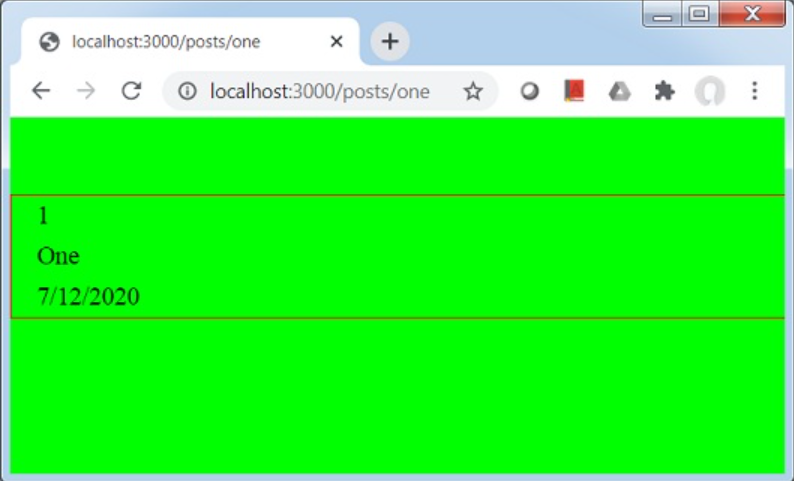
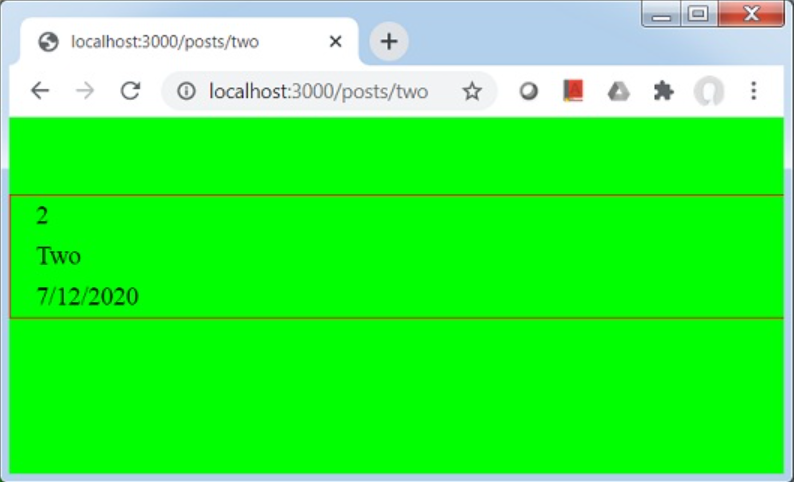

# Nextjs 学习

## 什么是 Next？能做什么？

Next 是一个应用在生产环境中的 react 框架，内置支持服务端渲染（SSR），静态页面生成（SSG），自带路由等

## 路由、页面间导航

### 静态路由

Next 静态路由把 /page 目录解析成根目录，将 URL 的域名后续部分按照文件系统的规则直接路由

例：

```
/page/index.js => /
/page/abc.js => /abc
```

### 动态路由

动态路由可以接收动态的路由参数

例如，将js文件名称设置为 [id].js

内容为：

```jsx
import Link from 'next/link'
import Head from 'next/head'
import Container from '../../components/container'
import { getAllPostIds, getPostData } from '../../lib/posts'
export default function Post({ postData }) {
return (
<container>
{postData.id}
<br>
{postData.title}
<br>
{postData.date}
</container>
)
}
export async function getStaticPaths() {
const paths = getAllPostIds()
return {
paths,
fallback: false
}
}
export async function getStaticProps({ params }) {
const postData = getPostData(params.id)
return {
props: {
postData
}
}
}
```

文件 post,js

``` jsx
export function getPostData(id) {
const postOne = {
title: 'One',
id: 1,
date: '7/12/2020'
}
const postTwo = {
title: 'Two',
id: 2,
date: '7/12/2020'
}
if(id == 'one'){
return postOne;
}else if(id == 'two'){
return postTwo;
}
}
export function getAllPostIds() {
return [{
params: {
id: 'one'
}
},
{
params: {
id: 'two'
}
}
];
}
```

启动后：

访问 localhost:3000/posts/one



访问 localhost:3000/posts/two



## 资源、元数据和css

### 资源

在 Next 中，类似图片资源等静态资源可以放置在 public 目录，这样操作上就可以按照文件系统的规则被链接

例：

``` 
/public/img/abc.png => /img/abc.png
```

### 元数据

如果要在组件中维护页面的 \<head> 头，可以使用 \<Head> 标记。

例：

``` jsx
export default function FirstPost() {
  return (
    <>
      <Head>
        <title>First Post</title>
      </Head>
      …
    </>
  )
}
```

在组件中这样使用 \<Head> 标签，title 元素将自动被覆写为新的 title 在页面上生效。

### CSS

可以使用 CSS 模块，可为某一个组件设置仅限于本组件作用域的 CSS ，能有效的解决classname 重名问题

使用 styled-jsx 库可以为组件创建专属作用域的 CSS 并且其支持Sass 

具体应用方法：

1. 创建顶级目录 components

2. 创建文件 layout.js 内容：

   ``` jsx
   export default function Layout({ children }) {
     return <div>{children}</div>
   }
   ```

3. 在父组件（pages/posts/first-post.js）中引入该组件

   ``` jsx
   import Head from 'next/head'
   import Link from 'next/link'
   import Layout from '../../components/layout'
   
   export default function FirstPost() {
     return (
       <Layout>
         <Head>
           <title>First Post</title>
         </Head>
         <h1>First Post</h1>
         <h2>
           <Link href="/">
             <a>Back to home</a>
           </Link>
         </h2>
       </Layout>
     )
   }
   ```

4. 给子组件 layout.js 添加样式，在 components 目录下新建 layout.module.css ，填入内容：

   ``` css
   .container {
     max-width: 36rem;
     padding: 0 1rem;
     margin: 3rem auto 6rem;
   }
   ```

5. import 引入样式到组件

   ``` jsx
   import styles from './layout.module.css'
   
   export default function Layout({ children }) {
     return <div className={styles.container}>{children}</div>
   }
   ```

   效果：

   

   