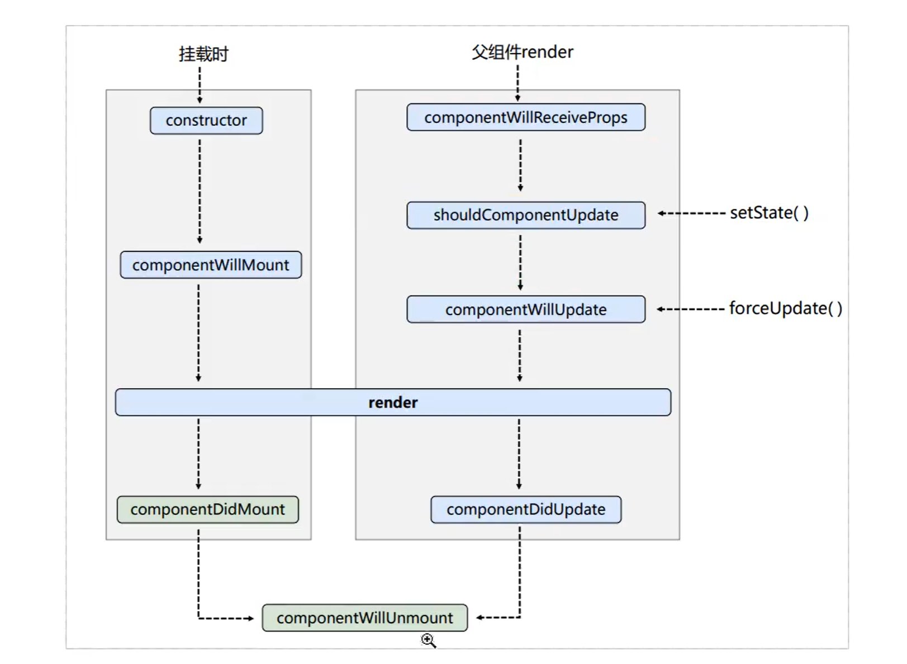

# React 学习笔记

## React 是什么

React 是一个用于构建用户界面的 JavaScript 库

React 没有封装其他例如数据请求的库，只负责页面渲染

## React 高效的原因

使用了虚拟 DOM 技术

使用 DOM Diffing 算法进行最小差异的界面重绘

## 资源引入

``` html
<!--核心库-->
<script src="https://unpkg.com/react@16/umd/react.development.js" crossorigin></script>
<!--用于支持React操作dom-->
<script src="https://unpkg.com/react-dom@16/umd/react-dom.development.js" crossorigin></script>
<!--用于支持jsx-->
<script src="https://unpkg.com/babel-standalone@6/babel.min.js"></script>
```

## JSX

React 定义的一种 JS 的扩展语法

### JSX 语法规则

- 定义虚拟DOM时不需要写引号
- 标签引入javascript表达式时要用{}
- 写类名不能用class，要用className
- 内联样式要用style={{key:value,key:value}}的形似去写
- 只能有一个根标签
- 标签必须闭合，例如\<br/\>
- 标签首字母
  - 小写时必须保证html有这个标签，没有则会报错
  - 大写时必须定义为组件才可以使用

## React 组件

- 函数式组件

  定义一个函数，形如：

  ```jsx
  function MyComponent(){
      return <p>我是一个函数式组件</p>
  }
  ```

  需要注意的是，函数式组件的函数名首字母应当大写

- 类式组件

  定义一个类，需要继承React.Component，形如：

  ``` jsx
  class MyComponent extends React.Component{
  	render(){
  		return <p>我是一个类式组件</p>
  	}
  }
  ```

  需要注意的是类式组件必须继承React.Component，类名的首字母需要大写

### React state

即类式组件的状态，状态驱动视图

``` jsx
class MyComponent extends React.Component{
	constructor(props){
		super(props)
		this.state = {
			isStudy: true
		}
	}
	render(){
		const {isStudy} = this.state
		return <p>今天{isStudy?'学习了':'没学习'}</p>
	}
}
```

### React 组件监听事件

以点击事件onclick为例，在jsx中需要写onClick，赋值要写{函数名}的形式，例如：

``` jsx
class MyComponent extends React.Component{
	constructor(props){
		super(props)
		this.state = {
			isStudy: true
		}
	}
	render(){
		const {isStudy} = this.state
		return <p onClick={dome}>今天{isStudy?'学习了':'没学习'}</p>
	}
}
```

### React 类式组件 this 指向问题

当在类式组件里面需要写一些方法完配合组件事件来更新state时，会出现this指向问题，因为只有当实例本身调用方法才能在方法里的this拿到实例本身，类式组件的方法默认开启了严格模式，所以需要在类的构造器里预修改具体方法的this指向，例如：

``` jsx
class MyComponent extends React.Component{
	constructor(props){
		super(props)
		this.state = {
			isStudy: true
		}
        this.changeStudy = this.changeStudy.bind(this)//关键代码
	}
	render(){
		const {isStudy} = this.state
		return <p onClick={this.changeStudy}>今天{isStudy?'学习了':'没学习'}</p>
	}
    
    changeStudy(){
        const isStudy = this.state.isStudy
        this.setState({isStudy:!isStudy})//这里需要调用内置方法setState更新状态，这样才会自动调用render重新渲染视图
    }
}
```

### 类式组件简写

``` jsx
class MyComponent extends React.Component{
    state = {isStudy: true}

    render(){
		const {isStudy} = this.state
		return <p onClick={this.changeStudy}>今天{isStudy?'学习了':'没学习'}</p>
	}
    
    changeStudy = ()=>{
        const isStudy = this.state.isStudy
        this.setState({isStudy:!isStudy})//这里需要调用内置方法setState更新状态，这样才会自动调用render重新渲染视图
    }
}
```

### React props

props 相当于组件或者函数的入参，组件渲染需要的差异化参数由它渲染

函数式组件应用案例：

``` jsx
function Welcome(props) {
  	return <h1>Hello, {props.name}</h1>;
}
```

类式组件应用案例：

```jsx
class Welcome extends React.Component {
  	render() {
    	return <h1>Hello, {this.props.name}</h1>;
  	}
}
```

渲染：

```jsx
const element = <Welcome name="Sara" />;
ReactDOM.render(
  	element,
  	document.getElementById('root')
);
```

### React refs

refs提供了一种访问Dom的方式，它能给组件被调用后的真实Dom做标记，这样就可以直接进行Dom操作

```jsx
class Welcome extends React.Component {
    showData = ()=>{
        const {input1} = this.refs
        alert(input1.value)
    }
    
  	render() {
    	return (
            <input ref="input1" />
            <button onClick={this.showData}>点击显示输入框内容</button>
        )
  	}
}
```

不推荐这样使用refs，因为其存在效率问题，应当使用回调形式的refs，其本质是使用ref取出dom然后挂载到组件实例自身上，形如：

```jsx
class Welcome extends React.Component {
    showData = ()=>{
        const {input1} = this
        alert(input1.value)
    }
    
  	render() {
    	return (
            <input ref={(currentNode)=>{this.input1 = currentNode}} />
            <button onClick={this.showData}>点击显示输入框内容</button>
        )
  	}
}
```

注意：如果使用回调内联的方法定义的，在更新的时候会被执行两次，第一次取得的是空对象，但是它其实无关紧要，如需避免则需要定义成类绑定的方式

### 受控组件和非受控组件

受控组件指的是改动实时维护到状态，例如边输入边将改动保存到state

非受控组件指的是先用现取的模式，通过refs来取得节点，在需要的时候拿取值

react官方建议我们不要过度使用refs，因此我们应当尽量使用受控组件的形式完成业务功能

### 高阶函数和函数的科里化

- 高阶函数

  1. 若函数接收到的参数包含一个函数
  2. 若函数返回的参数包含一个函数

- 函数的科里化技术

  指的是通过函数继续返回函数的形式多次接收高阶函数每次传入的参数，最后统一处理的的技术

### 组件的生命周期函数

 - 构造器

   constructor()

- 组件挂载

  render()

- 初始化完毕

  componentDidMount()

- 即将卸载组件

  componentWillUnmount()



## 列表渲染 key 的内部原理

### 虚拟DOM中key的作用

key是虚拟dom对象的标识符，在显示更新的时候有着极其重要的作用

当状态中的数据发生变化时，react会根据新数据生成新的虚拟dom，然后会根据diff算法比较新的虚拟dom与旧的dom的差异，比较算法为：

- 旧的dom中找到了与新的dom的key相同的对象

  对比其内容，发生改变则生成新的真实dom，替换掉旧的真实dom

  对比其内容，发生改变则不生成新的真实dom，直接使用旧的真实dom

- 旧的dom中没找到与新的dom的key相同的对象

  直接生成新的真实dom，然后渲染到页面上

### 用index作为key会存在的问题

因为数组追加元素时可能出现问题，比如直接在数组第一项追加内容，会让数组其他元素的index全部向后偏移，这样再渲染数据就会导致异常，将使得所有的真实dom全部推翻重建，效率低下，如果有输入框类组件，还会使得UI本身出现错版错误，但注意不是一定会出问题，有些场景下可以使用

## React 脚手架

1. 脚手架用来帮助程序员创建一个基于某技术库的模板项目
   1. 包含了所有需要的配置（语法检查、jsx编译、devServer...）
   2. 下载好了所有的相关依赖
   3. 可以直接运行一个简单的demo
2. react提供了一个穿件react项目的脚手架库：create-react-app
3. 项目的整体技术架构为：react+webpack+es6+eslint
4. 使用脚手架开发项目的特点：模块化、组件化、工程化

### 创建项目并启动

1. 下载安装react脚手架

   ``` shell
   npm i -g create-react-app
   ```

2. 切换到想创建应用的目录，使用命令

   ```shell
   create-react-app hello-react
   ```

   创建应用

3. 进入项目文件夹

   ```shell
   cd hello-react
   ```

4. 启动项目

   ``` shell
   npm start
   ```

### 脚手架目录结构

主要目录有两个

1. public

   静态资源文件夹

   - favicon.icon

     网站的图标

   - index.html

     主页面

   - login192.png

     logo图片

   - manifest.json

     应用的加壳文件，用它可以打包出移动端app

   - robots.txt

     爬虫协议文件

2. src

   源码文件夹

   - App.css

     app组件的样式

   - App.js

     app组件

   - App.test.js

     给app提供测试的文件

   - index.css

     首页样式

   - index.js

     入口文件

   - logo.svg

     logo图

   - reportWebVitals.js

     页面性能分析文件（需要web-vitals库的支持）

   - setupTests.js

     组件单元测试的文件（需要jest-dom库的支持）

### 脚手架组件校验

使用

```jsx
<React.StrictMode></React.StrictMode>
```

来包被要严格检查的组件，可以实现异常检查警告

## React ajax

react原生不包含ajax请求组件库，需要自己编写或者引入，建议使用axios

### cros跨域问题的解决

- 开发环境

  使用脚手架自带的代理配置，很简单，只需要在package.js文件中配置好proxy选项即可实现

  或者配置多代理服务器

  在src建立文件setupProxy.js

  ```javascript
  const proxy = require('http-proxy-middleware')
  
  module.exports = function(app){
      app.use(
      	proxy('/api1',
          	{
              	target: 'http://localhost:5000',//符合/api1路径的链接都会被转发到此
              	changeOrigin: true,//控制服务器接收到请求头中的host值
              	pathRewrite: {'^/api1':''}//重写请求路径
          	}
          ),
          proxy('/api2',
          	{
              	target: 'http://localhost:5001',//符合/api1路径的链接都会被转发到此
              	changeOrigin: true,//控制服务器接收到请求头中的host值
              	pathRewrite: {'^/api2':''}//重写请求路径
          	}
          )
      )
  }
  ```

- 生产环境

  生产部署时由于部署的已经是打包好的前端静态文件，客户端上没法要求用户都配置正向代理，这种情况下可以在服务器端nginx上配置反响代理，或者按照跨域规则设置http标头来实现

## React 路由

引入路由

``` javascript
import { BrowerRouter,Route,Link } from "react-router-dom"
```

路由分为两种

- BrowerRouter

  实现的方式类似于在域名后添加路径

- HashRouter

  实现方式类似于锚点

