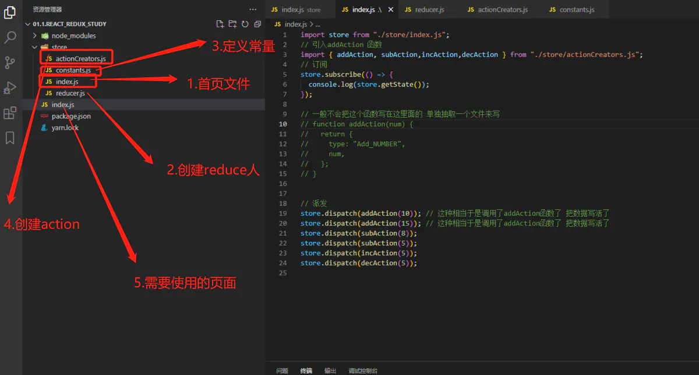
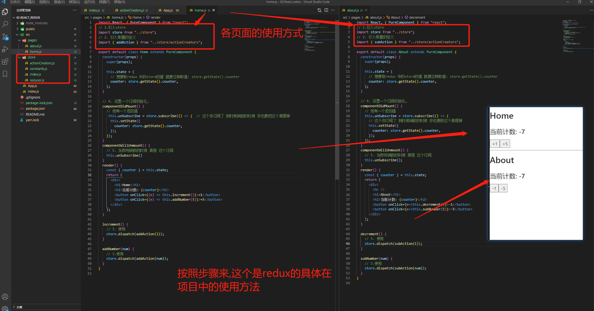

# Redux-saga学习

## Redux 部分

### Redux 用来做什么

Redux 是 JavaScript 状态容器，提供可预测化的状态管理。

可以让你构建一致化的应用，运行于不同的环境（客户端、服务器、原生应用），并且易于测试。不仅于此，它还提供 超爽的开发体验，比如有一个[时间旅行调试器可以编辑后实时预览](https://github.com/gaearon/redux-devtools)。

Redux 除了和 [React](https://facebook.github.io/react/) 一起用外，还支持其它界面库。 它体小精悍（只有2kB，包括依赖）。

### Redux 出现的动机

随着 JavaScript 单页应用开发日趋复杂，**JavaScript 需要管理比任何时候都要多的 state （状态）**。 这些 state 可能包括服务器响应、缓存数据、本地生成尚未持久化到服务器的数据，也包括 UI 状态，如激活的路由，被选中的标签，是否显示加载动效或者分页器等等。

管理不断变化的 state 非常困难。如果一个 model 的变化会引起另一个 model 变化，那么当 view 变化时，就可能引起对应 model 以及另一个 model 的变化，依次地，可能会引起另一个 view 的变化。直至你搞不清楚到底发生了什么。**state 在什么时候，由于什么原因，如何变化已然不受控制。** 当系统变得错综复杂的时候，想重现问题或者添加新功能就会变得举步维艰。

如果这还不够糟糕，考虑一些**来自前端开发领域的新需求**，如更新调优、服务端渲染、路由跳转前请求数据等等。前端开发者正在经受前所未有的复杂性，[难道就这么放弃了吗？](http://www.quirksmode.org/blog/archives/2015/07/stop_pushing_th.html)当然不是。

这里的复杂性很大程度上来自于：**我们总是将两个难以理清的概念混淆在一起：变化和异步**。 我称它们为[曼妥思和可乐](https://en.wikipedia.org/wiki/Diet_Coke_and_Mentos_eruption)。如果把二者分开，能做的很好，但混到一起，就变得一团糟。一些库如 [React](http://facebook.github.io/react) 试图在视图层禁止异步和直接操作 DOM 来解决这个问题。美中不足的是，React 依旧把处理 state 中数据的问题留给了你。Redux就是为了帮你解决这个问题。

跟随 [Flux](http://facebook.github.io/flux)、[CQRS](http://martinfowler.com/bliki/CQRS.html) 和 [Event Sourcing](http://martinfowler.com/eaaDev/EventSourcing.html) 的脚步，通过限制更新发生的时间和方式，**Redux 试图让 state 的变化变得可预测**。这些限制条件反映在 Redux 的[三大原则](https://www.redux.org.cn/docs/introduction/ThreePrinciples.html)中。

### Redux 的安装和使用

摘录：https://www.jianshu.com/p/857ed93abb1f

#### 安装

``` shell
yarn add redux / npm i redux --save
```

#### 独立应用

``` javascript
// 导入redux (不能使用ES6 的方式导入)
const redux = require("redux");

// redux 的三个核心

// 1. 定义初始化值
const initialState = {
  counter: 0,
};
// reducer
// 2.
function reducer(state = initialState, action) {
  console.log(state);

  console.log(action);

  switch (action.type) {
    case "INCREMENT":
      return {
        ...state, // 对原来的初始化值中的counter做一个拷贝
        counter: state.counter + 1,
      };
    case "DECREMENT":
      return {
        ...state,
        counter: state.counter - 1,
      };
    case "ADD_NUMBER":
      return {
        ...state,
        counter: state.counter + action.num,
      };
    case "SUB_NUMBER":
      return {
        ...state,
        counter: state.counter - action.num,
      };
    default:
      return state;
  }
}

// store (创建的时候需要传入一个reducer)
// 3.
const store = redux.createStore(reducer);


// 5.订阅store的修改
store.subscribe(() => {
  console.log("state发生了改变....", store.getState().counter);
});

// actions
// 4. 要派发的数据
const action1 = { type: "INCREMENT" };
const action2 = { type: "DECREMENT" };

const action3 = { type: "ADD_NUMBER", num: 5 }; // 递增
const action4 = { type: "SUB_NUMBER", num: 12 }; // 递减
store.dispatch(action1);
store.dispatch(action2);
store.dispatch(action2);
store.dispatch(action3);
store.dispatch(action4);
```

#### 结构划分



实现步骤：

先创建一个 store 文件夹

index.js

``` javascript
// 1.导入:
import redux from "redux";

// 2. 引入reducer
import reducer from "./reducer.js";

// 3.创建一个store
const store = redux.createStore(reducer)

export default store;
```

reducer.js

``` javascript
// 引入需要使用的常量
import { ADD_NUMBER, SUB_NUMBER, INCREMENT, DECREMENT } from "./constants.js";

const defaultState = {
  counter: 0,
};

function reducer(state = defaultState, action) {
  switch (action.type) {
    case ADD_NUMBER:
      return {
        ...state,
        counter: state.counter + action.num,
      };
    case SUB_NUMBER:
      return {
        ...state,
        counter: state.counter - action.num,
      };
    case INCREMENT:
      return {
        ...state,
        counter: state.counter + 1,
      };
    case DECREMENT:
      return {
        ...state,
        counter: state.counter - 1,
      };
    default:
      return state;
  }
}

export default reducer;
```

constants.js

``` javascript
// 定义需要使用的常量
// 专门定义常量的js文件
export const ADD_NUMBER = "ADD_NUMBER";
export const SUB_NUMBER = "SUB_NUMBER";

export const INCREMENT = "INCREMENT"
export const DECREMENT = "DECREMENT"
```

actionCreators.js

``` javascript
// 引入需要使用的 常量
import { ADD_NUMBER, SUB_NUMBER,INCREMENT,DECREMENT } from "./constants.js";

// 加
export const addAction = (num) => {
  return {
    type: ADD_NUMBER,
    num,
  };
};

// 减
export const subAction = (num) => ({
  type: SUB_NUMBER,
  num,
});

export const incAction = () => ({
  type: INCREMENT
})

export const decAction = () => ({
  type: DECREMENT
})
```

index.js / page.js /....

``` javascript
// 需要使用的页面
import store from "./store/index.js";
// 引入addAction 函数
import { addAction, subAction,incAction,decAction } from "./store/actionCreators.js";
// 订阅
store.subscribe(() => {
  console.log(store.getState());
});

// 一般不会把这个函数写在这里面的 单独抽取一个文件来写
// function addAction(num) {
//   return {
//     type: "Add_NUMBER",
//     num,
//   };
// }

// 派发
store.dispatch(addAction(10)); // 这种相当于是调用了addAction函数了 把数据写活了
store.dispatch(addAction(15)); // 这种相当于是调用了addAction函数了 把数据写活了
store.dispatch(subAction(8));
store.dispatch(subAction(5));
store.dispatch(incAction(5));
store.dispatch(decAction(5));
```

#### 和 React 结合应用

home.js 页面

``` javascript
import React, { PureComponent } from "react";
// 1.引入store
import store from "../store";
// 2. 引入常量的定义
import { subAction } from "../store/actionCreators";

export default class About extends PureComponent {
  constructor(props) {
    super(props);

    this.state = {
      // 想要取redux 中的store的值 就要这种取值: store.getState().counter
      counter: store.getState().counter,
    };
  }

  // 4. 设置一个订阅初始化,
  componentDidMount() {
    // 他有一个返回值
    this.unSubscribe = store.subscribe(() => {
      // 这个你订阅了 到时候销毁的时候 你也要把这个清理掉
      this.setState({
        counter: store.getState().counter,
      });
    });
  }
  componentWillUnmount() {
    // 5. 当即将销毁的时候 清楚 这个订阅
    this.unSubscribe();
  }
  render() {
    const { counter } = this.state;
    return (
      <div>
        <hr />
        <h1>About</h1>
        <h2>当前计数: {counter}</h2>
        <button onClick={e=>this.decrement()}>-1</button>
        <button onClick={e=>this.subNumber(5)}>-5</button>
      </div>
    );
  }

  decrement() {
    // 3. 使用
    store.dispatch(subAction(1));
  }

  subNumber(num) {
    // 3.使用
    store.dispatch(subAction(num));
  }
}

```

about.js 页面

``` javascript
import React, { PureComponent } from "react";
// 1.引入store
import store from "../store";
// 2. 引入常量的定义
import { subAction } from "../store/actionCreators";

export default class About extends PureComponent {
  constructor(props) {
    super(props);

    this.state = {
      // 想要取redux 中的store的值 就要这种取值: store.getState().counter
      counter: store.getState().counter,
    };
  }

  // 4. 设置一个订阅初始化,
  componentDidMount() {
    // 他有一个返回值
    this.unSubscribe = store.subscribe(() => {
      // 这个你订阅了 到时候销毁的时候 你也要把这个清理掉
      this.setState({
        counter: store.getState().counter,
      });
    });
  }
  componentWillUnmount() {
    // 5. 当即将销毁的时候 清楚 这个订阅
    this.unSubscribe();
  }
  render() {
    const { counter } = this.state;
    return (
      <div>
        <hr />
        <h1>About</h1>
        <h2>当前计数: {counter}</h2>
        <button onClick={e=>this.decrement()}>-1</button>
        <button onClick={e=>this.subNumber(5)}>-5</button>
      </div>
    );
  }

  decrement() {
    // 3. 使用
    store.dispatch(subAction(1));
  }

  subNumber(num) {
    // 3.使用
    store.dispatch(subAction(num));
  }
}
```

运行效果



## Redux-saga 部分

### Redux-saga 用来做什么

`redux-saga` 是一个用于管理应用程序 Side Effect（副作用，例如异步获取数据，访问浏览器缓存等）的 library，它的目标是让副作用管理更容易，执行更高效，测试更简单，在处理故障时更容易。

可以想像为，一个 saga 就像是应用程序中一个单独的线程，它独自负责处理副作用。 `redux-saga` 是一个 redux 中间件，意味着这个线程可以通过正常的 redux action 从主应用程序启动，暂停和取消，它能访问完整的 redux state，也可以 dispatch redux action。

redux-saga 使用了 ES6 的 Generator 功能，让异步的流程更易于读取，写入和测试。*（如果你还不熟悉的话，[这里有一些介绍性的链接](https://redux-saga-in-chinese.js.org/docs/ExternalResources.html)）* 通过这样的方式，这些异步的流程看起来就像是标准同步的 Javascript 代码。（有点像 `async`/`await`，但 Generator 还有一些更棒而且我们也需要的功能）。

你可能已经用了 `redux-thunk` 来处理数据的读取。不同于 redux thunk，你不会再遇到回调地狱了，你可以很容易地测试异步流程并保持你的 action 是干净的。
