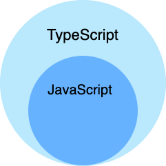
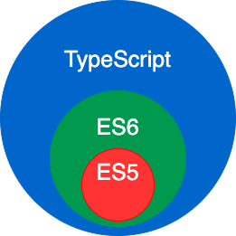

# Typescript 学习

## 特性

typescript 是一种给 javascript 添加特性的语言拓展，增加的功能包括：

- 类型批注和编译时类型检查
- 类型推断
- 类型擦除
- 接口
- 枚举
- Mixin
- 泛型编程
- 名字空间
- 元组
- Await





## 实现原理

typescript 是 javascript 的扩充，运行 typescript 需要先将其编译成 javascript，然后使用 node 一类的 javascript 引擎运行


## 基础类型

| 数据类型   | 关键字    | 描述                                                         |
| :--------- | :-------- | :----------------------------------------------------------- |
| 任意类型   | any       | 声明为 any 的变量可以赋予任意类型的值。                      |
| 数字类型   | number    | 双精度 64 位浮点值。它可以用来表示整数和分数。`let binaryLiteral: number = 0b1010; // 二进制 let octalLiteral: number = 0o744;    // 八进制 let decLiteral: number = 6;    // 十进制 let hexLiteral: number = 0xf00d;    // 十六进制` |
| 字符串类型 | string    | 一个字符系列，使用单引号（**'**）或双引号（**"**）来表示字符串类型。反引号（**`**）来定义多行文本和内嵌表达式。`let name: string = "Runoob"; let years: number = 5; let words: string = `您好，今年是 ${ name } 发布 ${ years + 1} 周年`;` |
| 布尔类型   | boolean   | 表示逻辑值：true 和 false。`let flag: boolean = true;`       |
| 数组类型   | 无        | 声明变量为数组。`// 在元素类型后面加上[] let arr: number[] = [1, 2]; // 或者使用数组泛型 let arr: Array<number> = [1, 2];` |
| 元组       | 无        | 元组类型用来表示已知元素数量和类型的数组，各元素的类型不必相同，对应位置的类型需要相同。`let x: [string, number]; x = ['Runoob', 1];    // 运行正常 x = [1, 'Runoob'];    // 报错 console.log(x[0]);    // 输出 Runoob` |
| 枚举       | enum      | 枚举类型用于定义数值集合。`enum Color {Red, Green, Blue}; let c: Color = Color.Blue; console.log(c);    // 输出 2` |
| void       | void      | 用于标识方法返回值的类型，表示该方法没有返回值。`function hello(): void {    alert("Hello Runoob"); }` |
| null       | null      | 表示对象值缺失。                                             |
| undefined  | undefined | 用于初始化变量为一个未定义的值                               |
| never      | never     | never 是其它类型（包括 null 和 undefined）的子类型，代表从不会出现的值。 |

**注意：**TypeScript 和 JavaScript 没有整数类型。

## 变量声明

### 类型定义

- 不带类型限制

  ``` typescript
  //var [变量] = 值;
  var a = "hello";
  ```

- 带类型限制

  ``` typescript
  //var [变量] : [类型] = 值;
  var a:string = "hello";
  ```

typescript 可以有联合类型

联合类型（Union Types）可以通过管道(|)将变量设置多种类型，赋值时可以根据设置的类型来赋值。

**注意**：只能赋值指定的类型，如果赋值其它类型就会报错。

例如：

``` typescript
var val:string|number 
val = 12 
console.log("数字为 "+ val) 
val = "Runoob" 
console.log("字符串为 " + val)
```

typescript 可以只定义变量不赋初始值

typescript 的变量是强类型约束的

### 类型断言

类型断言可以手动指定一个指的类型，让其从一种类型更改为另一种类型

``` typescript
//语法格式
//<类型>值
//值 as 类型
var str = '1' 
var str2:number = <number> <any> str   //str、str2 是 string 类型
console.log(str2)
```

当 S 类型是 T 类型的子集，或者 T 类型是 S 类型的子集时，S 能被成功断言成 T。这是为了在进行类型断言时提供额外的安全性，完全毫无根据的断言是危险的，如果你想这么做，你可以使用 any。

它之所以不被称为**类型转换**，是因为转换通常意味着某种运行时的支持。但是，类型断言纯粹是一个编译时语法，同时，它也是一种为编译器提供关于如何分析代码的方法。

## 函数

### 返回值

typescript可以规定函数的返回值

例如：

``` typescript
function function_name():string { 
    // 语句
    return value; 
}
```

它规定函数必须返回一个 string 类型的值，不返回或返回其他类型的值无法进行编译。

### 参数

typescript 函数携带参数时可以对参数的类型进行限定

``` typescript
function add(x: number, y: number): number {
    return x + y;
}
console.log(add(1,2))
```

### 可选参数

在 TypeScript 函数里，如果我们定义了参数，则我们必须传入这些参数，除非将这些参数设置为可选，可选参数使用问号标识 ？。

``` typescript
function buildName(firstName: string, lastName?: string) {
    if (lastName)
        return firstName + " " + lastName;
    else
        return firstName;
}
 
let result1 = buildName("Bob");  // 正确
let result2 = buildName("Bob", "Adams", "Sr.");  // 错误，参数太多了
let result3 = buildName("Bob", "Adams");  // 正确
```

### 默认参数

我们也可以设置参数的默认值，这样在调用函数的时候，如果不传入该参数的值，则使用默认参数，语法格式为：

```
function function_name(param1[:type],param2[:type] = default_value) { 
}
```

注意：参数不能同时设置为可选和默认。

以下实例函数的参数 rate 设置了默认值为 0.50，调用该函数时如果未传入参数则使用该默认值：

``` typescript
function calculate_discount(price:number,rate:number = 0.50) { 
    var discount = price * rate; 
    console.log("计算结果: ",discount); 
} 
calculate_discount(1000) 
calculate_discount(1000,0.30)
```

### 剩余参数

有一种情况，我们不知道要向函数传入多少个参数，这时候我们就可以使用剩余参数来定义。

剩余参数语法允许我们将一个不确定数量的参数作为一个数组传入。

``` typescript
function addNumbers(...nums:number[]) {  
    var i;   
    var sum:number = 0; 
    
    for(i = 0;i<nums.length;i++) { 
       sum = sum + nums[i]; 
    } 
    console.log("和为：",sum) 
 } 
 addNumbers(1,2,3) 
 addNumbers(10,10,10,10,10)
```

### 匿名函数

匿名函数是没有函数名称的函数，除了没有函数名称以外与正常函数没有太大的差异

例如：

``` typescript
var msg = function() { 
    return "hello world";  
} 
console.log(msg())
```

### Lambda 函数

也被称之为箭头函数

例如：

``` typescript
var foo = (x:number)=>10 + x 
console.log(foo(100))      //输出结果为 110
```

### 函数重载

重载是方法名字相同，而参数不同，返回类型可以相同也可以不同。

每个重载的方法（或者构造函数）都必须有一个独一无二的参数类型列表。

- 参数类型不同：

    ```typescript
    function disp(string):void; 
    function disp(number):void;
    ```

- 参数数量不同：

    ```typescript
    function disp(n1:number):void; 
    function disp(x:number,y:number):void;
    ```

- 参数类型顺序不同：

    ```typescript
    function disp(n1:number,s1:string):void; 
    function disp(s:string,n:number):void;
    ```